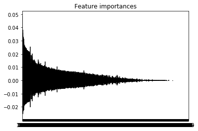

  The "sklearn_feature_selection.ipynb" file is the feature selection method of using sklearn, and we will draw the conclusion by this.

Feature ranking:
1. feature 306 (0.013455)
2. feature 1497 (0.007056)
3. feature 199 (0.006417)
4. feature 266 (0.005821)
5. feature 117 (0.005545)
6. feature 226 (0.005395)
7. feature 228 (0.005297)
8. feature 265 (0.005207)
9. feature 264 (0.004942)
10. feature 203 (0.004935)

......

1794. feature 347 (0.000001)

1795. feature 457 (0.000001)

1796. feature 72 (0.000000)

1797. feature 449 (0.000000)

1798. feature 78 (0.000000)

1799. feature 70 (0.000000)

1800. feature 1066 (0.000000)

1801. feature 345 (0.000000)

1802. feature 1475 (0.000000)

1803. feature 1049 (0.000000)

     

     A random forest algorithm with 100000 decision trees was run to decide which features are more important,and the result is as above.From this we know that feature 306 can be very important,and there are several features, such as feature 345,feature 1475,feature 1049 and so on, that can be of no use for our work.

